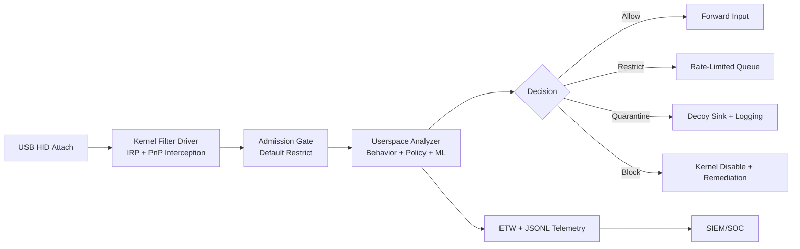

# HID Shield Architecture (Bootstrap)

## High-level data path

## Zero Trust defaults

- No device is trusted at attach time.
- Unknown devices are restricted until verification completes.
- Timeouts and internal errors fail secure to restricted or block.
- Tombstoned fingerprints cannot be auto-approved by policy updates.

## Performance budget (phase target)

- Kernel attach/intercept and queue write: <= 1 ms
- Stage-1 rules and policy lookup: <= 2 ms
- Optional Stage-2 ML for ambiguous events: <= 5 ms
- End-to-end p95 legitimate input latency: < 10 ms
- Idle endpoint CPU overhead: < 2%

## Current bootstrap modules

- SetupAPI-based HID enumeration
- Lock-free SPSC queue for HID events
- SHA-256 descriptor hashing (Windows CNG)
- Behavioral feature extraction (IKD windows + variance)
- Rule-based threat classification
- Policy action mapping (allow/restrict/quarantine/block)
- ETW event provider registration and emission
- Pluggable incident remediation callbacks
- ONNX integrity-verified stage-2 inference stub

## Next implementation milestones

1. Add KMDF filter driver and IoRegisterPlugPlayNotification path.
2. Replace simulated input events with Raw Input and ETW process telemetry correlation.
3. Add signed policy store and anti-rollback enforcement.
4. Add immutable log chain and OCSF JSONL emitter.
5. Add incident response actions (process kill, network isolate, ticket webhook).
